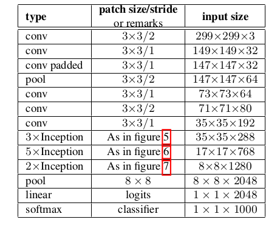

# Implemetation-of-VGG16-ResNet18-InceptionV2-on-Cifar100

**Introduction**

Aim of the project is to implement convolution neural network, VGG16, ResNet18 and Inception V2 architecture using
two optimizers, Adam and SGD. Also, to understand the architectures properly, architectures are implemented in three
parts, firstly with no regularization, second, with Batch Normalization and lastly with Dropouts regularization.

**Data-set and Pre-Processing**

CIFAR-100 dataset is used to implement all the architectures. The data-set has 100 classes containing 500 training
images and 100 testing images, totalling to 60,000 images. Each class is a part of one of the 20 super classes.Each
image comes with a fine label, the class to which it belongs, and a coarse label, the super class to which it belongs.[10]
Pre-Processing: Size of each image in the data-set is (32,32.3). To use it in the architectures I re-scaled the images
by 255.0 and then converted them in to categorical data by one hot encoding. One- hot encoding is a representation of
categorical variables as binary vectors. This method makes the deep learning model easier and faster to train. Also, it
gives better outputs than the other method like integer encoding.

***VGG16**

VGG 16 was proposed by Karen Simonyan and Andrew Zisserman of the Visual Geometry Group Lab of Oxford
University in 2014 in the paper “Very Deep Convolutional networks for large- scale image recognition”. Original
architecture of the model is as follows: The input to the model is the image of dimension (224,224,3).The first two
layers have 64 channels of (3,3) filter size and same padding. Then after a max pool layer of stride (2, 2), two layers
which have convolution layers of 256 filter size and filter size (3, 3). This followed by a max pooling layer of stride
(2, 2). Then there are 2 convolution layers of filter size (3, 3) and 256 such filters. After that there are 2 sets of 3
convolution layer with 512 filters of size (3,3) each, a max pool layer, and with same padding.This image is then passed
to the stack of two convolution layers. After these convolutional layers and max pooling, we get (7,7,512) feature map,
after this layers are flattened followed by 3 fully connected layers. In the end softmax layer is passed to normalize the
classification vector.[11]
Architecture I followed for each variation is as follows:

  
  * No Regularization
    For No regularization, I was not allowed to use any kind of regularizers like batch normalization, weight decay or
    dropouts. To implement this I reduced the convolutional and max pooling layers to 6 and 3 respectively. Firstly I used
    two convolution layers of kernel size 64 with 64 such filters followed by max pooling of pool size 2. Then again used
    two such combination of convolution layers and max pooling of same size, (3,3) with 128 and 256 filters respectively.
    Earlier, I used the ’relu’ activation but while training the model it was over-fitting after certain point with very low
    accuracy. Therefore, I changed the Activation to ’LeakyRelu’ which gave me better training accuracy of 61.05% and
    testing accuracy of 50.82% for Adam optimizer and 42.13% and 37.95% for SGD optimizer which is significantly
    lower than the adam optimizer.
 * Batch Normalization
   For implementation of VGG16 using regularizer batch normalization, I used the original architecture of VGG16 as
   described above. I used batch normalization after every stack on layers to reduce the trainable parameters and train the
   model faster. In the end i reduced the size of filters of two dense layers from 4096 to 2048 and 1024 respectively. When
   training the model, i used data augmentation to increases the training dataset which resulted in better accuracies. The
   training accuracy I achieved is 87.94% and testing accuracy of 62.3% for adam optimize. For SGD optimizer i reduced
   the convolution layers to 10 layers and got 68.35% training accuracy and 53.35% testing accuracy.
 * Dropouts
   For implementation of VGG16 using regularizer dropouts, I used the original architecture of VGG16 as described above.
   I used batch normalization after every stack on layers to reduce the trainable parameters. In the end i reduced the size of
   filters of two dense layers from 4096 to 2048 and 1024 respectively. When training the model, i used data augmentation
   to increases the training dataset which resulted in better accuracies. The training accuracy I achieved is 92.36% and
   testing accuracy of 62.23% for adam optimizer,which is almost equal to one i got with batch normalization regularizer
   for. In case of SGD optimizer I reduced the convolution layers same as batch normalization for SGD optimizer and got
   70.05% training accuracy and 60.95% testing accuracy.
   
***ResNet18**

ResNet architecture performs the initial convolution and max-pooling using 7×7 and 3×3 kernel sizes respectively.
In stage 1 of the network it has 4 Residual blocks containing 2 layers each. The size of kernels used to perform the
convolution operation in 2 layers of the block of stage 1 are 64 and 64 respectively.Similarly, for all the other stages I
used 128, 256 and 512 number of filters. Resnet is of two types namely without skip and skip, i used the skip ResNet
architecture as it gives more accuracy and it is easier to train this model, although the process to construct this model
from scratch is computationally heavy and lengthy. After the all the stages of convolution stages, average pooling is
performed followed by flattening the layers and using dense layer of 100 neurons. I used data Augmentation to train the
models.

 * No Regularization
   To implement this I reduced the convolutional and max pooling layers in stage 2, 3 and 4 to half. Firstly I used one
   convolution layer of kernel size 7x7 with 64 such filters followed by max pooling of pool size 2. I used the ’relu’
   activation but while training the model it was over-fitting after certain point with very low accuracy. Therefore, I
   reduced the learning rate to 1e-03 which gave me training accuracy of 93.46% and testing accuracy of 55.06% for
   Adam optimizer and 62.61% training accuracy and 49.19% testing accuracy for SGD optimizer.
   
 * Batch Normalization
   To implement this, I used the same architecture used in no regularization. Used batch normalization regularizer after
   every convolution layer. This helped in reducing the trainable parameters and train the model faster. For Adam optimizer,
   I got training accuracy of 94.77% and testing accuracy of 55.84%. For SGD optimizer, training accuracy is 97.7% and
   testing accuracy of 54.86%.
   
 * Dropouts
   For this regularization method, I used dropotus with rate of 0.5 after every convolution layer. Also, to avoid the
   overfitting and to train the model faster I used batch normalization too. After training model I got the training accuracy
   of of 69.37% and testing accuracy of 58.24% for Adam optimizer. For SGD optimizer I didnt use batch normalization
   regularizer and also used more layers in stage 2 but used half layers in stage 3 and 4. After training the model got
   trainig accuracy of 64.93% and testing accuracy of 55.94%.
   
***Inception V2**

Inception V2 was introduced to in order to reduce the computational cost. In order to achieve that people who introduces
this model factorized the 5x5 convolution to 3x3 convolution.Moreover, they factorize convolutions of filter size nxn to
a combination of 1xn and nx1 convolutions. he filter banks in the module were expanded to remove the representational
bottleneck. The above three principles were used to build three different types of inception modules as follows:
To implement this model on Cifar-100, i significantly reduced the number of filters in each convolution layer of the
model in each variation.

 * No Regularization
   To implement this part of the architecture I used the original Inception V2 architecture excluding the two reduction
   convolutional blocks. To avoid the over-fitting and increase the accuracy, I used ’elu’ activation instead of ’relu’.
   After training the model i got training accuracy of 64% and testing accuracy of 32.64% for adam optimizer. For SGD
   optimizer, I got the training accuracy of 59.5% and testing accuracy of 39.45%.
   
 * Batch Normalization
   For batch normalization I used LeakyRelu activation as elu and relu both were unable to avoid over-fitting. Also, used
   batch normalization only at the end of all layers of each convolutional block. I reduced the number of convolutional
   block A,B and C to 2,3 and 1 respectively.For adam optimizer i got training accuracy of 51.55% and testing accuracy of
   33.42%. For SGD optimizer, training accuracy is 65.78% and testing accuracy of 44.45%.
   
 * Dropouts
   For dropout regularization, I didnt use the data augmentation and model fit generator, instead I used model fit and
   increased the trainable prameters by not using the reduction blocks and also reducing the number of convolution blocks
   A,B and C to 2,3 and 1 respectively. For this part also, I used Leaky Relu activation instead of relu and elu as that were
   unable to avoid the over-fitting of the model. After training the model for adam optimizer, I got training and testing
   accuracy of 76.72 and 32% respectively. For SGD optimizer, I got the training and testing accuracy of 91.98% and
   36.89% respectively. float
   
***Final Results**

|      | Arch                | VGG16    |           |        | ResNet18 |           |        | Inception V2 |           |        |   |
|------|---------------------|----------|-----------|--------|----------|-----------|--------|--------------|-----------|--------|---|
|      | Score               | Accuracy | Precision | Recall | Accuracy | Precision | Recall | Accuracy     | Precision | Recall |   |
| ADAM | No Regularization   | 50.82    | 64.88     | 42.45  | 55.06    | 59.21     | 53.3   | 32.64        | 56.52     | 26.01  |   |
|      | Batch Normalization | 62.3     | 70.04     | 59.29  | 55.84    | 63.17     | 52.88  | 33.42        | 56.06     | 23.09  |   |
|      | Dropouts            | 62.23    | 66.63     | 60.93  | 58.24    | 72.6      | 51.04  | 32           | 52.96     | 22.18  |   |
| SGD  | No Regularization   | 37.95    | 70.35     | 23.63  | 49.19    | 64.63     | 40.68  | 39.45        | 63.64     | 26.95  |   |
|      | Batch Normalization | 53.35    | 73.72     | 42.28  | 54.86    | 63.27     | 51.48  | 44.45        | 60.95     | 36.53  |   |
|      | Dropouts            | 60.95    | 73.49     | 54.49  | 55.94    | 70.04     | 48.54  | 36.89        | 42.13     | 34.72  |   |

***Refrences**

1. https://medium.com/the-owl/building-inception-resnet-v2-in-keras-from-scratch-a3546c4d93f0
2. https://hackmd.io/@bouteille/SkD5Xd4DL
3. https://arxiv.org/pdf/1512.00567.pdf
4. https://arxiv.org/pdf/1602.07261v1.pdf
5. https://cv-tricks.com/keras/understand-implement-resnets/
6. https://github.com/kklosowski/CIFAR10-with-Keras/blob/master/Cifar10Keras.ipynb
7. https://github.com/priya-dwivedi/Deep-Learning/blob/master/resnetkeras=ResidualNetworksyourself:ipynb
8. https://www.kaggle.com/athota1/vgg16-cifar100-v2/comments
9. https://flyyufelix.github.io/2016/10/08/fine-tuning-in-keras-part2.html
10.https://www.cs.toronto.edu/ kriz/cifar.html
11.https://www.geeksforgeeks.org/vgg-16-cnn-model/
